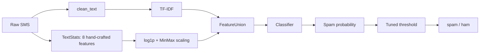
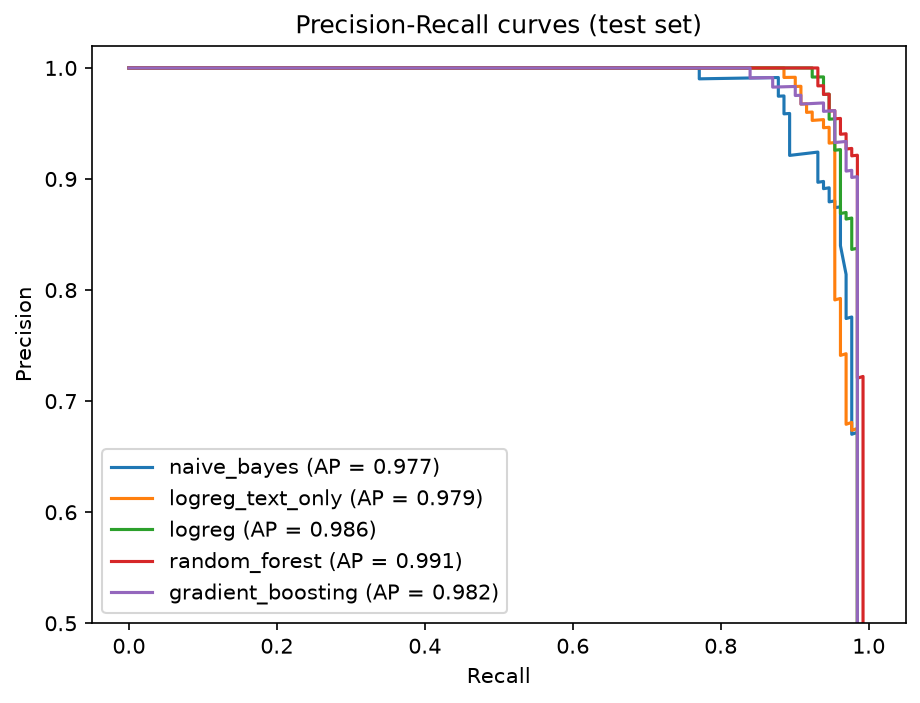
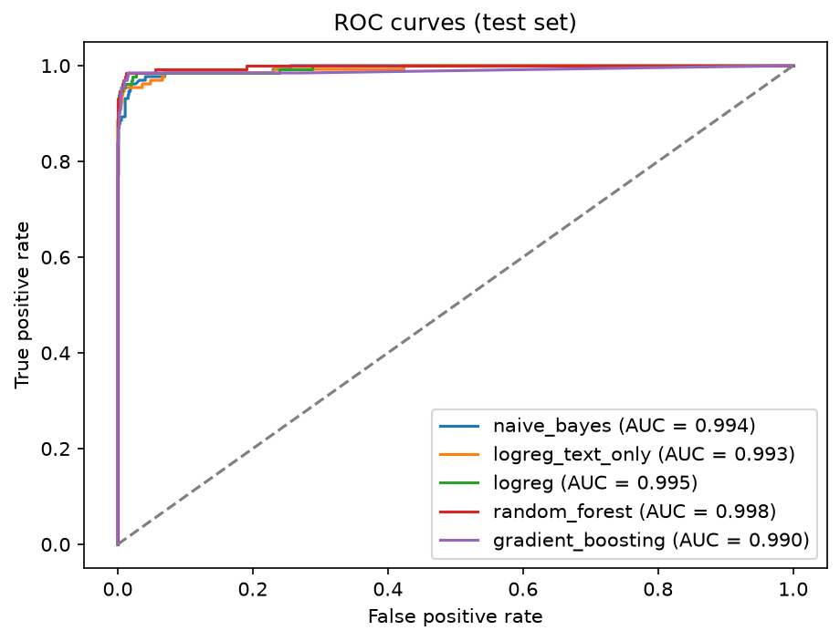
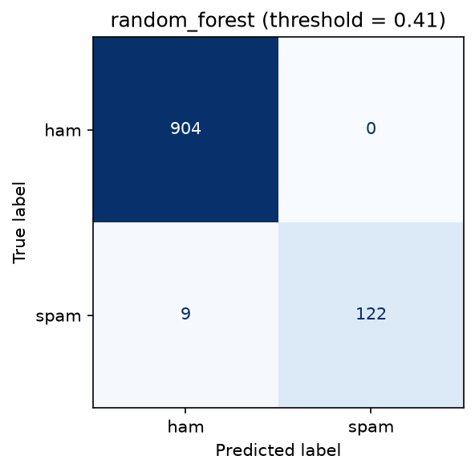
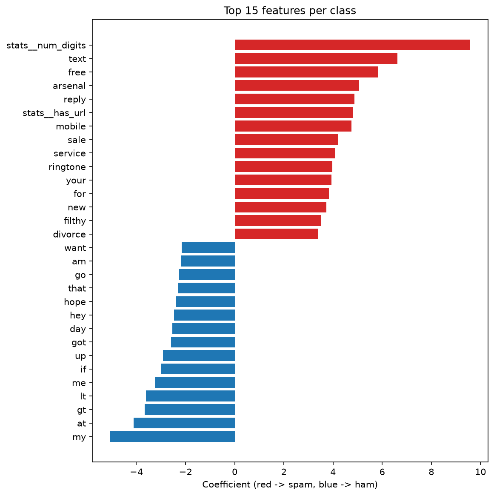

# SMS Spam Detection


[](https://github.com/AlejandroLopezData/sms-spam-classifier/actions/workflows/ci.yml)

A machine learning project that classifies SMS messages as **spam** or **ham** (legitimate). It compares
several classical models under a leakage-free, cross-validated protocol, tunes the decision threshold for
high precision, and ships a small CLI to classify new messages.

The project started as a coursework notebook and was rebuilt as a reproducible Python package with
proper validation, baselines, tests and CI.

## Key results

The model selected by cross-validation (**Random Forest**) reaches, on a held-out test set of 1,035 messages
(131 spam):

| Precision (spam) | Recall (spam) | False positives | False negatives | PR-AUC |
|:---:|:---:|:---:|:---:|:---:|
| **1.000** | **0.931** | **0** of 904 ham | 9 of 131 spam | 0.991 |

No legitimate message was flagged as spam. A logistic regression, which is fully interpretable, is
almost as good (precision 0.992, recall 0.924). See [Results](#results) for the full comparison and why
the difference between the two should not be over-interpreted.

## Dataset

[SMS Spam Collection](https://archive.ics.uci.edu/dataset/228/sms+spam+collection) (UCI): 5,574 English
SMS messages labelled `ham` or `spam`.

- **403 duplicated messages** were removed *before* splitting, so the same text cannot appear in both
  train and test. This leaves 5,171 messages.
- **Imbalanced:** 4,518 ham (87.4%) vs 653 spam (12.6%). All splits are stratified, and the main metric is
  PR-AUC instead of accuracy or ROC-AUC, which look optimistic on imbalanced data.
- Spam messages are roughly twice as long as ham on average, and are far more likely to contain
  currency symbols, digits, phone numbers and URLs. The exploratory analysis is in
  [`notebooks/01_eda.ipynb`](notebooks/01_eda.ipynb).

<p align="center">
  
  
</p>

## Approach



**Design decisions**

- **No data leakage.** TF-IDF and scaling live inside a scikit-learn `Pipeline`, so they are fitted on
  training folds only. The test set is used once, at the end.
- **Entities become tokens, not noise.** URLs, emails, phone numbers and currency symbols are replaced by
  placeholder tokens (`urltoken`, `phonetoken`, `currencytoken`, ...) instead of being deleted, so the
  model can still use them as signal.
- **Hand-crafted features from the raw text:** length, has URL / email / phone, number of digits,
  uppercase letters, exclamation marks and symbols (`$ £ € % & @ # *`). They are log-transformed and
  min-max scaled.
- **Model selection by cross-validation.** 5-fold stratified `GridSearchCV` optimising PR-AUC. The best
  model is chosen by CV score, never by test performance.
- **Threshold tuning without touching the test set.** The decision threshold is the one with the highest
  recall subject to precision >= 0.98, computed on out-of-fold predictions over the training data.
  Rationale: flagging a legitimate message as spam is usually worse than letting a spam through.
- **Baselines and ablation.** Naive Bayes and logistic regression are included as simple baselines, and
  logistic regression is run with and without the hand-crafted features.

## Results

Test set: 1,035 messages (904 ham, 131 spam). CV column: mean PR-AUC over 5 folds on the training set.
Precision, recall and F1 are for the spam class at the tuned threshold.

| Experiment | Hand-crafted feats | CV PR-AUC | Test PR-AUC | Test ROC-AUC | Threshold | Precision | Recall | F1 | FP | FN |
|---|:---:|:---:|:---:|:---:|:---:|:---:|:---:|:---:|:---:|:---:|
| Naive Bayes | no | 0.9747 | 0.9769 | 0.9941 | 0.424 | 0.951 | 0.893 | 0.921 | 6 | 14 |
| Logistic Regression | no | 0.9799 | 0.9787 | 0.9930 | 0.672 | 0.992 | 0.893 | 0.940 | 1 | 14 |
| Logistic Regression | yes | 0.9805 | 0.9857 | 0.9953 | 0.752 | 0.992 | 0.924 | 0.957 | 1 | 10 |
| **Random Forest** | yes | **0.9827** | **0.9910** | **0.9977** | 0.415 | **1.000** | **0.931** | **0.964** | **0** | **9** |
| Gradient Boosting | yes | 0.9670 | 0.9817 | 0.9896 | 0.907 | 0.991 | 0.870 | 0.927 | 1 | 17 |

<p align="center">
  
  
</p>

<p align="center">
  
</p>

### What the results show

- **Random Forest is the best model by CV, but the margin over logistic regression is tiny** (0.9827 vs
  0.9805 PR-AUC), and on the test set it amounts to one message (9 vs 10 missed spam). With only 131
  spam messages, this is within noise. Logistic regression is a very competitive, faster and interpretable
  alternative.
- **Hand-crafted features help modestly.** In cross-validation the logistic regression scores are almost
  identical with and without them (0.9805 vs 0.9799); on the test set they reduce missed spam from 14 to 10
  and raise PR-AUC from 0.979 to 0.986. This is suggestive rather than conclusive.
- **Gradient Boosting was the weakest model.** Its grid was small and it was not tuned extensively, so this
  says little about the algorithm in general.
- **Threshold tuning is useful but not guaranteed to transfer.** For the Random Forest, lowering the
  threshold from 0.5 to 0.415 recovered 3 more spam messages with no extra false positives (recall 0.908
  -> 0.931). For Naive Bayes, the precision target of 0.98 ended up at 0.951 on the test set, since its
  probabilities are poorly calibrated.

### Interpretability

The most influential features of the logistic regression (red: pushes towards spam, blue: towards ham):

<p align="center">
  
</p>

Misclassified test messages of the selected model are saved to `reports/errors.csv` for manual inspection.

## Usage

```bash
# 1. Install
python -m venv .venv && source .venv/bin/activate      # Windows: .venv\Scripts\activate
pip install -e ".[dev,notebook]"

# 2. Get the data (downloads to data/raw/)
spam-download

# 3. Train, tune and compare all experiments (writes model, reports and figures)
spam-train

# 4. Classify new messages
spam-predict "URGENT! You have won a £1000 prize, call 09061234567 now"
# [SPAM] p(spam) = 0.895 | URGENT! You have won a £1000 prize, call 09061234567 now

spam-predict --file messages.txt        # one message per line

# Tests and linting
pytest
ruff check .
```

Experiments, hyperparameter grids, seed and threshold settings are defined in
[`configs/config.yaml`](configs/config.yaml). Exact values may vary slightly across library versions.

## Project structure

```
spam-detection/
├── configs/config.yaml          # seed, experiments, hyperparameter grids
├── data/                        # dataset instructions (raw data is git-ignored)
├── notebooks/01_eda.ipynb       # exploratory data analysis
├── src/spam_detection/
│   ├── data.py                  # download, load, deduplicate, split
│   ├── features.py              # text cleaning + hand-crafted features
│   ├── models.py                # pipeline definitions
│   ├── train.py                 # cross-validated comparison, threshold, model export
│   ├── evaluate.py              # metrics, threshold selection, plots
│   └── predict.py               # CLI inference
├── tests/                       # pytest suite
├── models/                      # trained model (joblib)
├── reports/                     # results.csv, best_params.json, errors.csv, figures/
└── .github/workflows/ci.yml     # lint + tests on every push
```

## Limitations and next steps

- **Small test set.** 131 spam messages mean wide confidence intervals; bootstrap intervals or repeated
  cross-validation would quantify this.
- **Single, dated dataset.** English SMS collected in the 2000s. Modern spam (phishing links, other
  languages, different styles) would likely need retraining.
- **Model selection and evaluation on the same folds protocol.** Nested cross-validation would give a less
  biased estimate of generalisation.
- **Possible near-duplicates** (only exact duplicates were removed) could slightly inflate test scores.
- **Ideas to try:** character n-grams, probability calibration, sentence embeddings or a fine-tuned
  transformer as a stronger baseline, and a small web demo.

## Data source and license

Dataset: Almeida, T.A., Gómez Hidalgo, J.M., Yamakami, A. (2011). *Contributions to the study of SMS spam
filtering: new collection and results.* ACM Symposium on Document Engineering.

Code released under the MIT License.
